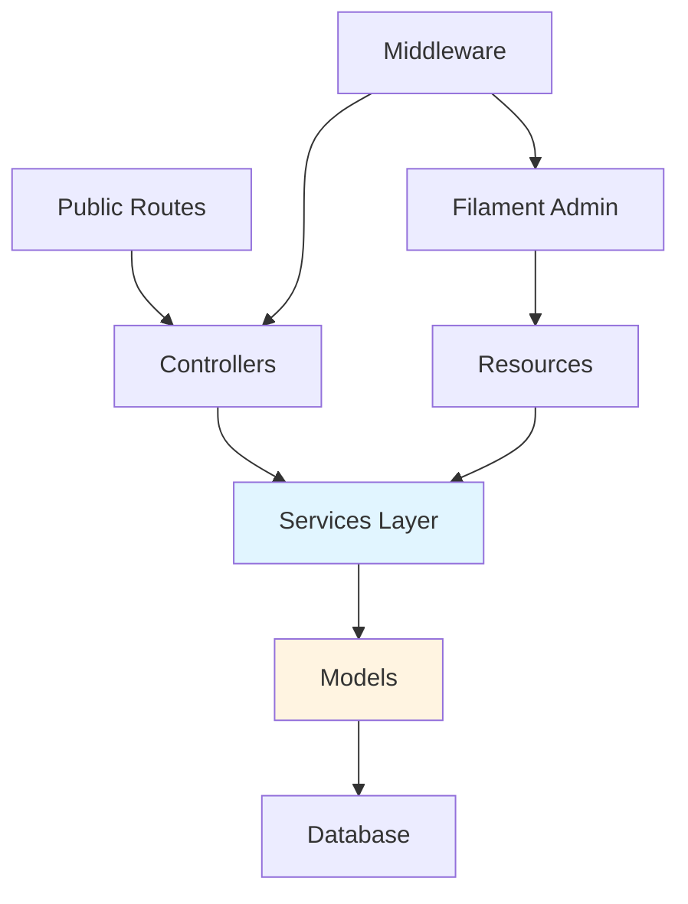
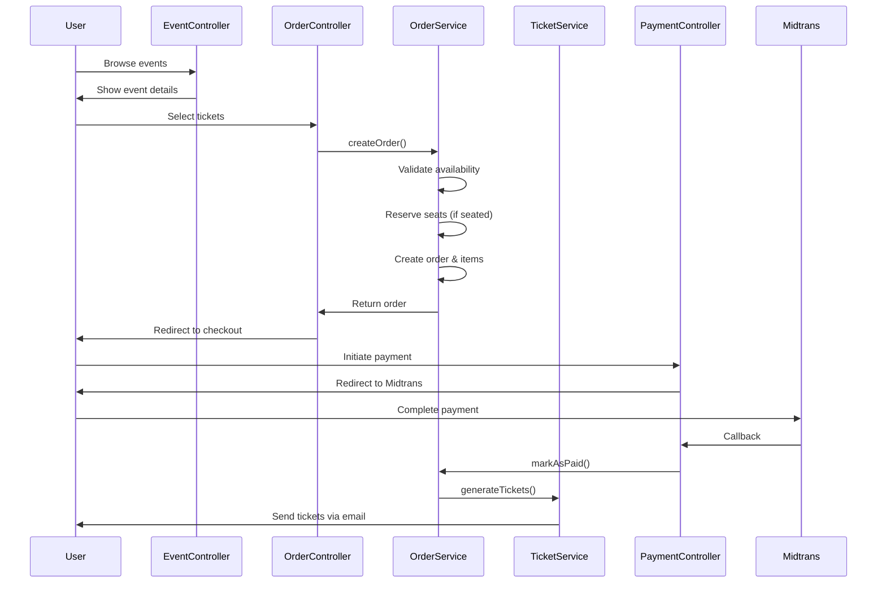
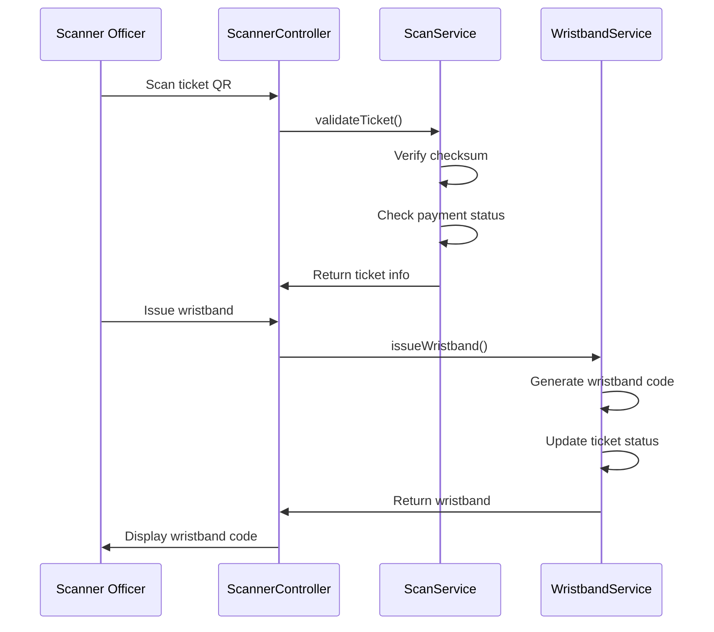
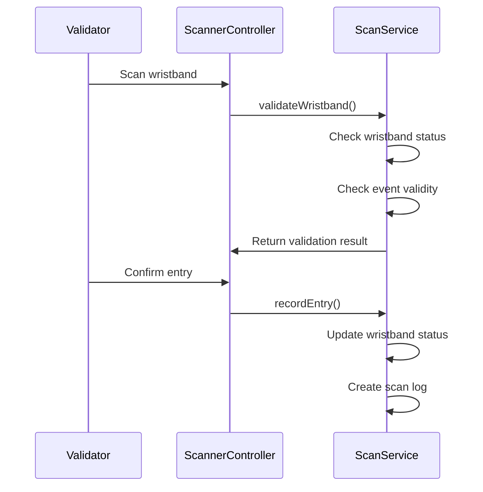

# Tiketin Project - Comprehensive Analysis

## Executive Summary

**Tiketin** adalah sistem manajemen tiket event berbasis web yang dibangun dengan **Laravel 11** dan **Filament 3**. Sistem ini mendukung multi-tenancy (berbasis Client), penjualan tiket online, manajemen tempat duduk, integrasi pembayaran (Midtrans), sistem wristband exchange, dan scanning tiket.

---

## 1. Tech Stack

### Backend
- **Framework**: Laravel 11 (PHP 8.2+)
- **Admin Panel**: Filament 3.3
- **Database**: SQLite (development)
- **Payment Gateway**: Midtrans PHP SDK
- **QR Code**: SimpleSoftwareIO Simple QR Code
- **Authorization**: Filament Shield (Role & Permission)

### Frontend
- **CSS Framework**: Tailwind CSS 3.4
- **Build Tool**: Vite 6
- **Template Engine**: Blade
- **JavaScript**: Axios (untuk AJAX)

---

## 2. Architecture Overview

### Multi-Tenancy Pattern
Project menggunakan **Client-based multi-tenancy** dengan `ClientScope` global scope:
- Setiap [Event](file:///d:/Web%20Personal/tiketin/app/Models/Event.php#13-135), [Order](file:///d:/Web%20Personal/tiketin/app/Models/Order.php#13-123), dan entitas terkait diisolasi per [Client](file:///d:/Web%20Personal/tiketin/app/Models/Client.php#11-43)
- User terikat ke satu [Client](file:///d:/Web%20Personal/tiketin/app/Models/Client.php#11-43) melalui `client_id`
- Filament Shield mengelola role & permission per client

### Application Layers



---

## 3. Data Models & Relationships

### Core Entities

#### Client (Multi-tenancy)
```php
- id
- name, email, phone, address
- status (active/inactive)
- Has Many: users, events
```

#### Event
```php
- id, client_id, venue_id, event_category_id
- name, slug, description
- banner_image, additional_images (array)
- event_date, event_end_date
- status (draft/published/closed)
- has_assigned_seating (boolean)
- wristband_exchange_start, wristband_exchange_end
- Belongs To: client, venue, eventCategory
- Has Many: ticketCategories, orders, promoCodes, scanLogs
```

#### Order
```php
- id, order_number, order_token (UUID)
- event_id
- consumer_name, consumer_email, consumer_whatsapp
- consumer_identity_type (ktp/sim/passport)
- consumer_identity_number
- subtotal, discount_amount, total_amount
- payment_status (pending/success/failed/paid/expired/canceled)
- payment_method, paid_at, expires_at
- Belongs To: event
- Has Many: orderItems, tickets, paymentTransactions, promoCodeUsages
```

#### Ticket
```php
- id, uuid (untuk QR code)
- order_id, ticket_category_id, seat_id
- consumer_name, consumer_identity_type, consumer_identity_number
- status (pending_payment/paid/exchanged/cancelled)
- checksum (SHA256 untuk validasi QR)
- Belongs To: order, ticketCategory, seat
- Has One: wristband
- Morph Many: scanLogs
```

#### TicketCategory
```php
- id, event_id, venue_section_id
- name, description, price
- quantity, sold_count
- is_seated (boolean)
- Belongs To: event, venueSection
- Has Many: orderItems, tickets
```

#### Wristband
```php
- id, ticket_id, event_id
- wristband_code (unique)
- status (pending/issued/validated/revoked)
- issued_at, validated_at
- Belongs To: ticket, event
- Morph Many: scanLogs
```

### Supporting Entities

- **Venue**: Tempat event (name, city, address, capacity)
- **VenueSection**: Bagian dari venue (name, capacity)
- **Seat**: Kursi individual (row, number, status: available/reserved/sold)
- **PromoCode**: Kode promo (code, type: percentage/fixed, value, min_purchase, max_usage)
- **PaymentTransaction**: Log transaksi pembayaran
- **ScanLog**: Log scanning (polymorphic: ticket/wristband)
- **EventCategory**: Kategori event (name, description)

---

## 4. Business Logic Flow

### A. Order Creation Flow



**Key Points:**
1. **Order Expiration**: Order memiliki `expires_at` (default 30 menit)
2. **Seat Reservation**: Kursi di-reserve saat order dibuat, dirilis jika expired
3. **Ticket Generation**: Tiket dibuat setelah pembayaran sukses
4. **QR Code**: Setiap tiket memiliki UUID + checksum untuk validasi

### B. Wristband Exchange Flow



### C. Entry Validation Flow



---

## 5. Controllers & Services

### Controllers

#### EventController
- [index()](file:///d:/Web%20Personal/tiketin/app/Http/Controllers/EventController.php#10-22): List published events
- [show($slug)](file:///d:/Web%20Personal/tiketin/app/Http/Controllers/EventController.php#23-40): Show event detail

#### OrderController
- [create($eventSlug)](file:///d:/Web%20Personal/tiketin/app/Http/Controllers/OrderController.php#19-38): Show ticket selection (seated/non-seated)
- [store(Request, $eventSlug)](file:///d:/Web%20Personal/tiketin/app/Http/Controllers/OrderController.php#39-78): Create order
- [checkout($orderToken)](file:///d:/Web%20Personal/tiketin/app/Http/Controllers/OrderController.php#79-100): Show checkout page
- [applyPromo(Request, $orderToken)](file:///d:/Web%20Personal/tiketin/app/Http/Controllers/OrderController.php#101-131): Apply promo code
- [show($orderToken)](file:///d:/Web%20Personal/tiketin/app/Http/Controllers/EventController.php#23-40): Show order details

#### PaymentController
- `initiate($orderToken)`: Initiate Midtrans payment
- `callback(Request)`: Handle Midtrans callback
- `finish($orderToken)`: Payment finish page

#### ScannerController
- **Exchange**: `exchangeIndex()`, `scanTicket()`, `issueWristband()`, `exchangeHistory()`
- **Validate**: `validateIndex()`, `scanWristband()`, `confirmEntry()`, `validateHistory()`

#### ScannerAuthController
- `showLogin()`, `login()`, `logout()`

### Services

#### OrderService
- [createOrder(array $data)](file:///d:/Web%20Personal/tiketin/app/Services/OrderService.php#13-85): Create order with items, validate availability, reserve seats
- [calculateTotal(Order, ?promoCode)](file:///d:/Web%20Personal/tiketin/app/Services/OrderService.php#86-111): Calculate total with discount
- [cancelExpiredOrders()](file:///d:/Web%20Personal/tiketin/app/Services/OrderService.php#112-145): Release seats & update status
- [markAsPaid(Order, array)](file:///d:/Web%20Personal/tiketin/app/Services/OrderService.php#146-171): Mark order as paid, generate tickets

#### TicketService
- `generateTickets(Order)`: Generate tickets for paid order
- `generateQRCode(Ticket)`: Generate QR code for ticket

#### WristbandService
- `issueWristband(Ticket)`: Issue wristband for ticket
- `validateWristband(string $code)`: Validate wristband
- `recordEntry(Wristband)`: Record entry scan

#### ScanService
- `validateTicket(string $uuid, string $checksum)`: Validate ticket QR
- `validateWristband(string $code)`: Validate wristband code
- `recordScan(...)`: Record scan log

#### PromoService
- `validatePromoCode(string $code, Event)`: Validate promo code
- `calculateDiscount(...)`: Calculate discount amount
- `applyPromoCode(Order, PromoCode)`: Apply promo to order

#### PaymentService
- `createTransaction(Order)`: Create Midtrans transaction
- `handleCallback(array)`: Process Midtrans callback
- `verifySignature(array)`: Verify webhook signature

---

## 6. Frontend Implementation

### Public Views Structure

```
resources/views/
├── layouts/
│   └── app.blade.php          # Main layout
├── events/
│   ├── index.blade.php        # Event listing
│   └── show.blade.php         # Event detail
├── orders/
│   ├── create.blade.php       # Ticket selection (non-seated)
│   ├── create-seated.blade.php # Ticket selection (seated)
│   ├── checkout.blade.php     # Checkout page
│   └── show.blade.php         # Order confirmation
├── payment/
│   └── finish.blade.php       # Payment result
└── scanner/
    ├── login.blade.php
    ├── exchange/
    │   ├── index.blade.php
    │   └── history.blade.php
    └── validate/
        ├── index.blade.php
        └── history.blade.php
```

### Current Frontend Characteristics

#### Styling
- **Tailwind CSS** dengan utility classes
- Warna utama: Indigo (`bg-indigo-600`, `text-indigo-600`)
- Desain minimalis, clean, functional

#### UI Components
- Form inputs dengan validation error display
- Card-based layouts untuk event dan order items
- Responsive grid layouts (mobile-first)
- Simple buttons dengan hover states

#### User Experience
1. **Event Browsing**: Simple card grid
2. **Ticket Selection**: Form dengan quantity input per kategori
3. **Checkout**: Order summary + promo code input + payment button
4. **Order Confirmation**: Ticket details dengan QR code

---

## 7. Filament Admin Resources

### Resources Available
1. **ClientResource**: Manage clients (multi-tenancy)
2. **EventResource**: Manage events (dengan relasi ke venue, categories)
3. **EventCategoryResource**: Manage event categories
4. **TicketCategoryResource**: Manage ticket categories per event
5. **OrderResource**: View & manage orders
6. **PromoCodeResource**: Manage promo codes
7. **VenueResource**: Manage venues & sections
8. **UserResource**: Manage users & roles
9. **RoleResource**: Manage roles & permissions (Shield)

### Filament Widgets
- Dashboard widgets untuk statistik (7 widgets tersedia)

---

## 8. Pain Points & Areas for Improvement

### A. Frontend UX Issues

#### 1. **Event Browsing Experience**
- ❌ Tidak ada filter/search untuk events
- ❌ Tidak ada category filtering
- ❌ Pagination sederhana tanpa infinite scroll
- ❌ Tidak ada event image preview (hanya gradient placeholder)
- ❌ Tidak ada featured/upcoming events section

#### 2. **Ticket Selection Process**
- ❌ UI untuk seated tickets ([create-seated.blade.php](file:///d:/Web%20Personal/tiketin/resources/views/orders/create-seated.blade.php)) sangat kompleks (14KB file)
- ❌ Tidak ada real-time seat availability update
- ❌ Tidak ada visual seat map untuk seated events
- ❌ Quantity input manual tanpa +/- buttons
- ❌ Tidak ada order summary preview saat memilih tiket

#### 3. **Checkout Experience**
- ❌ Tidak ada countdown timer visual untuk order expiration
- ❌ Promo code application tidak real-time (perlu reload)
- ❌ Tidak ada loading states saat apply promo
- ❌ Tidak ada payment method preview sebelum redirect

#### 4. **Order Confirmation**
- ❌ QR code generation tidak terlihat di view
- ❌ Tidak ada download ticket button
- ❌ Tidak ada share/email ticket functionality
- ❌ Tidak ada order tracking status

#### 5. **Visual Design**
- ❌ Desain terlalu plain/generic
- ❌ Tidak ada brand identity yang kuat
- ❌ Kurang engaging untuk event ticketing platform
- ❌ Tidak ada animations/transitions
- ❌ Event images tidak digunakan (hanya gradient)

### B. Backend/Process Issues

#### 1. **Order Management**
- ⚠️ Order expiration handling bergantung pada scheduled job (tidak ada di code)
- ⚠️ Seat reservation bisa race condition tanpa proper locking
- ⚠️ Tidak ada order cancellation flow untuk user

#### 2. **Payment Integration**
- ⚠️ Midtrans callback tidak ada retry mechanism
- ⚠️ Tidak ada payment status polling untuk user
- ⚠️ Webhook validation middleware (`validate.webhook`) tidak terlihat

#### 3. **Ticket Delivery**
- ⚠️ Email sending untuk tickets tidak terlihat di code
- ⚠️ Tidak ada PDF ticket generation
- ⚠️ QR code generation ada di service tapi tidak di-render di view

#### 4. **Scanner App**
- ⚠️ Scanner authentication terpisah dari main auth
- ⚠️ Tidak ada offline mode untuk scanning
- ⚠️ History hanya list, tidak ada analytics

---

## 9. Recommended Refactoring Areas

### High Priority

#### 1. **Event Browsing & Discovery**
- [ ] Add search functionality
- [ ] Add category filtering
- [ ] Add date range filtering
- [ ] Implement event card dengan images
- [ ] Add featured events section
- [ ] Improve pagination (infinite scroll atau better UI)

#### 2. **Ticket Selection UX**
- [ ] Refactor [create-seated.blade.php](file:///d:/Web%20Personal/tiketin/resources/views/orders/create-seated.blade.php) menjadi component-based
- [ ] Implement visual seat map (SVG atau Canvas)
- [ ] Add real-time availability check (AJAX)
- [ ] Add +/- quantity buttons
- [ ] Add floating order summary sidebar
- [ ] Add ticket selection validation sebelum submit

#### 3. **Checkout Process**
- [ ] Add visual countdown timer
- [ ] Implement real-time promo validation (AJAX)
- [ ] Add loading states & transitions
- [ ] Show payment method options preview
- [ ] Add order summary breakdown yang lebih jelas

#### 4. **Order Confirmation & Tickets**
- [ ] Generate & display QR code
- [ ] Add download PDF ticket button
- [ ] Add email ticket functionality
- [ ] Add order status tracking
- [ ] Add calendar integration (Add to Calendar)

#### 5. **Visual Design Overhaul**
- [ ] Create design system dengan brand colors
- [ ] Add hero section untuk homepage
- [ ] Implement card hover effects & animations
- [ ] Add skeleton loaders
- [ ] Use actual event images instead of gradients
- [ ] Add glassmorphism effects untuk modern look

### Medium Priority

#### 6. **Performance Optimization**
- [ ] Implement lazy loading untuk images
- [ ] Add caching untuk event listings
- [ ] Optimize database queries (N+1 problem)
- [ ] Add Redis untuk session & cache

#### 7. **Mobile Experience**
- [ ] Improve mobile navigation
- [ ] Add bottom sheet untuk ticket selection
- [ ] Optimize touch interactions
- [ ] Add PWA support untuk scanner app

#### 8. **Admin Panel Enhancements**
- [ ] Add bulk operations untuk orders
- [ ] Add export functionality (CSV/Excel)
- [ ] Add analytics dashboard
- [ ] Add email template customization

---

## 10. Technology Recommendations

### Frontend Enhancements
1. **Alpine.js**: Untuk interactivity tanpa full framework
2. **Livewire**: Untuk real-time features (seat selection, promo validation)
3. **Chart.js**: Untuk analytics di admin panel
4. **QRCode.js**: Untuk client-side QR generation
5. **Swiper.js**: Untuk event image carousels

### Backend Improvements
1. **Laravel Horizon**: Untuk queue monitoring
2. **Laravel Telescope**: Untuk debugging
3. **Spatie Media Library**: Untuk better image handling
4. **Laravel Excel**: Untuk export functionality
5. **Laravel Sanctum**: Untuk API authentication (mobile app future)

---

## 11. Database Optimization Suggestions

### Missing Indexes
```sql
-- Orders table
ALTER TABLE orders ADD INDEX idx_payment_status (payment_status);
ALTER TABLE orders ADD INDEX idx_expires_at (expires_at);

-- Tickets table
ALTER TABLE tickets ADD INDEX idx_status (status);

-- Seats table
ALTER TABLE seats ADD INDEX idx_status (status);
```

### Potential Issues
- Seat reservation race condition → Add database-level locking
- Order expiration → Implement scheduled job atau queue
- Promo code usage tracking → Add composite index

---

## 12. Security Considerations

### Current Implementation
✅ CSRF protection (Laravel default)
✅ SQL injection protection (Eloquent ORM)
✅ Password hashing (Laravel default)
✅ QR checksum validation (SHA256)

### Improvements Needed
⚠️ Rate limiting untuk public routes
⚠️ Webhook signature validation
⚠️ Input sanitization untuk user-generated content
⚠️ File upload validation untuk event images
⚠️ API rate limiting untuk scanner endpoints

---

## Summary

Tiketin adalah sistem ticketing yang **solid secara arsitektur** dengan:
- ✅ Clean separation of concerns (Controllers → Services → Models)
- ✅ Multi-tenancy implementation yang baik
- ✅ Comprehensive data model dengan proper relationships
- ✅ Payment gateway integration
- ✅ QR-based ticketing system

Namun **frontend memerlukan refactoring signifikan** untuk:
- 🎨 Meningkatkan visual appeal & brand identity
- ⚡ Menambahkan interactivity & real-time features
- 📱 Memperbaiki mobile experience
- 🎫 Menyempurnakan ticket selection & checkout flow
- 📊 Menambahkan analytics & reporting

**Next Steps**: Membuat implementation plan untuk refactoring frontend dengan fokus pada UX improvements dan visual design overhaul.
